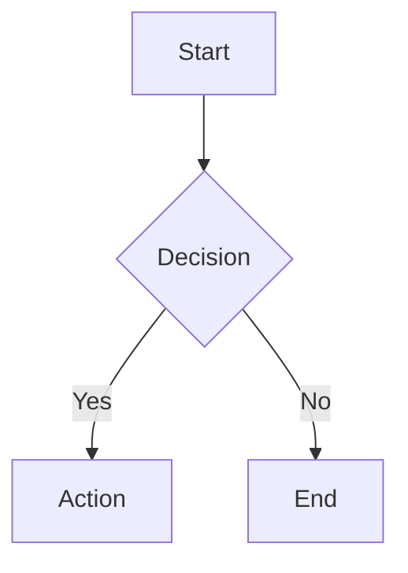

# Live Preview

The preview pane renders your Markdown in real time as you type. It sits on the right side of the split-pane layout and supports rich content including diagrams, math formulas, and syntax-highlighted code.

<!-- TODO:  -->

## Basics

- The preview updates live as you edit — no manual refresh needed
- DOM-diffing (via idiomorph) ensures flicker-free updates
- Toggle the preview with **Cmd+3**
- Drag the divider to adjust the editor/preview ratio

## Scroll Sync

The editor and preview panes stay in sync as you scroll. This is bidirectional — scrolling either pane moves the other to the corresponding position. The sync is viewport-based, so it works accurately even with complex content like images and diagrams.

## Mermaid Diagrams

Fenced code blocks with the `mermaid` language tag are rendered as diagrams:

````markdown

````

<!-- TODO:  -->

Mermaid is lazy-loaded — the library is only fetched when a diagram is first encountered.

### Mermaid Viewer

Click any Mermaid diagram in the preview to open the fullscreen viewer. The viewer provides:

- **Zoom** — scroll wheel, or use the +/− buttons in the toolbar
- **Pan** — click and drag to move around
- **Fit** — press F or click "Fit" to fit the diagram to the viewport
- **Copy as PNG** — export the diagram as a 2x Retina PNG image

<!-- TODO:  -->

See [Keyboard Shortcuts](keyboard-shortcuts.md) for all viewer shortcuts.

## KaTeX Math

Inline math uses single dollar signs and display math uses double dollar signs:

```markdown
Inline: $E = mc^2$

Display:
$$
\int_0^\infty e^{-x^2} dx = \frac{\sqrt{\pi}}{2}
$$
```

<!-- TODO:  -->

KaTeX is lazy-loaded on first use.

## Code Highlighting

Fenced code blocks with a language tag are syntax-highlighted using highlight.js. 24 languages are supported. A **Copy** button appears on hover, making it easy to copy code snippets.

````markdown
```python
def greet(name: str) -> str:
    return f"Hello, {name}!"
```
````

<!-- TODO:  -->

highlight.js is lazy-loaded on first use.

## GitHub-Style Alerts

Blockquotes with alert tags are rendered with colored icons:

```markdown
> [!NOTE]
> Useful information the user should know.

> [!TIP]
> Helpful advice for doing things better.

> [!WARNING]
> Urgent information that needs immediate attention.
```

Supported types: `[!NOTE]`, `[!TIP]`, `[!WARNING]`, `[!IMPORTANT]`, `[!CAUTION]`.

## SVG Inlining

Remote SVG images (e.g., badges) are fetched and rendered inline with sanitization, so they display correctly even when loaded from external URLs.
